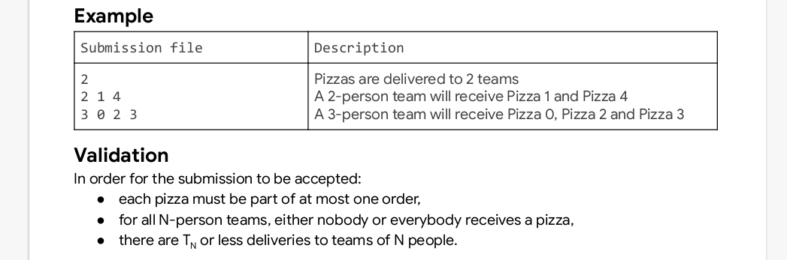

# THE PIZZA :pizza::pizza::pizza: PROBLEM  

The pizza program is a solution implementation for the practice problem in the hash code competition,
organized by google.

## Problem Background and Approach
The task at hand was to help an imaginary **pizzeria** choose the **pizzas** to deliver to hash code **teams**. Using *Object Oriented Programming*, we were able to implement the three objects:
* Pizzeria
* Pizza
* Team 

> For more details on what is implemented in each of the objects, check the source code and read the problem statement.


## Datasets
5 distinct data sets have been provided, different data but same structure.
This is the structure that has been used: *the description is not part of the output*

### Input
The following is the layout of the input


### Output
The following is the template for the output



## Installation and execution
1. For you to run the program you need to have **Python** Installed.\n
2. Once you have python, clone this repository. Here is a link to do that \n
  [repository](https://github.com/SamuelKiragu/hash_code.git)
3. Navigate to the directory where you've cloned the repository **(use the terminal)**
4. Run the following command
   ```
   python obj\.py \./datasets/b\_little\_bit\_of\_everything\.in
   ```
 >This executes a python program obj\.py which takes a data file as a system argument variable and creates an output\.txt file to store the sorted pizzas\.
 > Replace b\_little_bit_of_everything.in
