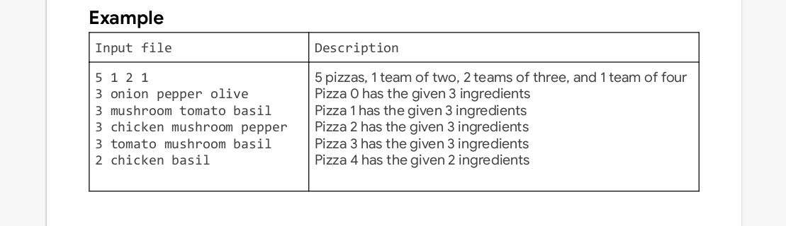

# THE PIZZA :pizza::pizza::pizza: PROBLEM  

The pizza program is a solution implementation for the practice problem in the hash code competition,
organized by google.

## Problem Background and Approach
The task at hand was to help an imaginary **pizzeria** choose the **pizzas** to deliver to hash code **teams**. Using *Object Oriented Programming*, we were able to implement the three objects:
* Pizzeria
* Pizza
* Team 

> For more details on what is implemented in each of the objects, check the source code and read the problem statement.

## Datasets
5 distinct data sets have been provided, different data but same structure.
This is the structure that has been used:
 

